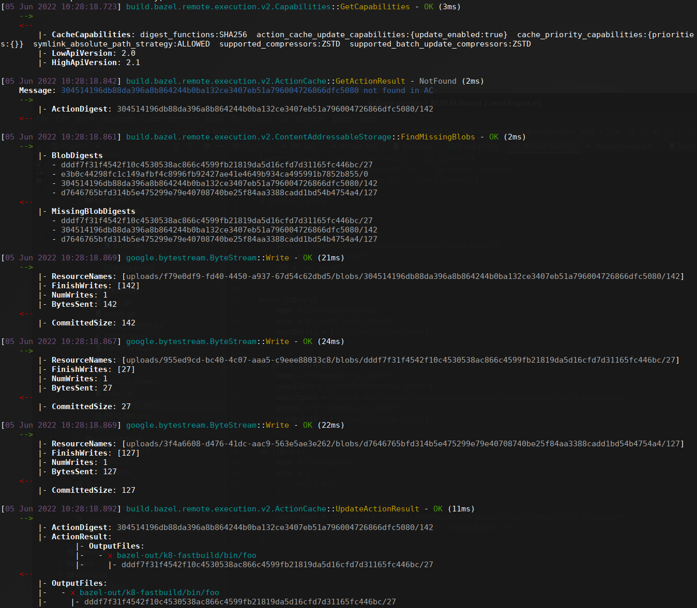

# bazel-remote-cache-client


`bazel-remote-cache-client` is a tool to easily access of a [Bazel remote cache] object.

This tools is able to:

- Read a specific AC object.
- Read a specific CAS object.
- Read a gRPC remote cache log file created by `bazel --experimental_remote_grpc_log`.

## Installation

```sh
$ bazel build //cmd/bazel-remote-cache-client
```

The `bazel-remote-cache-client` is build in `bazel-bin/cmd/bazel-remote-cache-client/bazel-remote-cache-client_/bazel-remote-cache-client`.

## Getting started

```sh
$ bazel-remote-cache-client --help
```

```text
CLI to show Bazel remote cache entries (CA and CAS)

Usage:
  bazel-remote-cache-client [command]

Available Commands:
  action-cache              Manage AC entries
  content-addressable-store Manage CAS entries
  help                      Help about any command
  log                       Print in a human-readable format a gRPC remote execution log file

Flags:
  -h, --help       Show this help and exit
      --no-color   Disable color output
  -v, --version    version for bazel-remote-cache-client

Use "bazel-remote-cache-client [command] --help" for more information about a command.
```

### Read AC object

```sh
$ bazel-remote-cache-client ac get --remote localhost:9092 \
    908085c97f53e58132f07eb7c64118ec05a67ed7ab93102b914e54b96c293488 \
    ed54247875d2f69fada38439d47bff3f322b2c8ce057a09d185699868ab30390
```

```text
908085c97f53e58132f07eb7c64118ec05a67ed7ab93102b914e54b96c293488:
  OutputFiles:
    - bazel-out/k8-fastbuild/testlogs/wd/foo/foo_test/test.xml
      |- 0f117422f50beac3dc24cb1afb58e42b477f3d6d4afecc792f820b204ab71788/161
    - bazel-out/k8-fastbuild/testlogs/wd/foo/foo_test/coverage.dat
      |- ef2f3431e974a514693787c6b42facf9de1a4261990d935039782a7c32930884/140
  Stdout: 19a8a1640ff62fe13a078b08cf04ea29df596a4ac9c6247c0a1032b21e1fa1e7/196

ed54247875d2f69fada38439d47bff3f322b2c8ce057a09d185699868ab30390:
  OutputFiles:
    - x bazel-out/k8-fastbuild/bin/wd/foo/foo_test_/foo_test
      |- c1d243b3b868a91f30fc43d179fbcb5df76c84583a06303b2dce5f7d0e7cf392/2535424
```

### Read CAS object

```sh
$ bazel-remote-cache-client cas get --remote localhost:9092 \
    19a8a1640ff62fe13a078b08cf04ea29df596a4ac9c6247c0a1032b21e1fa1e7/196
```

```text
exec ${PAGER:-/usr/bin/less} "$0" || exit 1
Executing tests from //wd/foo:foo_test
-----------------------------------------------------------------------------
PASS
coverage: 50.0% of statements
```

### Read gRPC remote cache log file

```sh
$ bazel build build \
    --remote_cache=grpc://localhost:9092 \
    --experimental_remote_grpc_log=/tmp/grpc.log \
    //...

$ bazel-remote-cache-client log /tmp/grpc.log
```



[Bazel remote cache]: https://github.com/buchgr/bazel-remote
